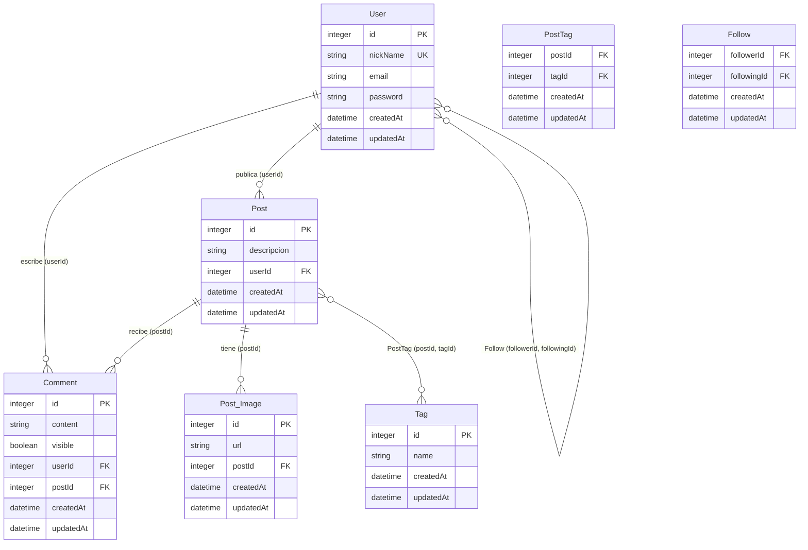

# Diagrama Entidad-Relación (DER) — Anti-Social Net

## Diagrama completo

## Relaciones

| Entidad origen | Relación | Entidad destino | Clave foránea |
|----------------|----------|-----------------|---------------|
| User | 1:N | Post | Post.userId → User.id |
| User | 1:N | Comment | Comment.userId → User.id |
| Post | 1:N | Comment | Comment.postId → Post.id |
| Post | 1:N | Post_Image | Post_Image.postId → Post.id |
| Post | N:M | Tag | PostTag (postId, tagId) |
| User | N:M | User (seguidores) | Follow (followerId, followingId) |

## Cardinalidades

- Un **User** puede tener muchos **Posts** y muchos **Comments**.
- Un **Post** pertenece a un **User**, puede tener muchas **Post_Image**, muchos **Comments** y muchos **Tags**.
- Un **Comment** pertenece a un **User** y a un **Post**.
- Un **User** puede seguir y ser seguido por otros **Users** mediante la tabla intermedia **Follow**.
